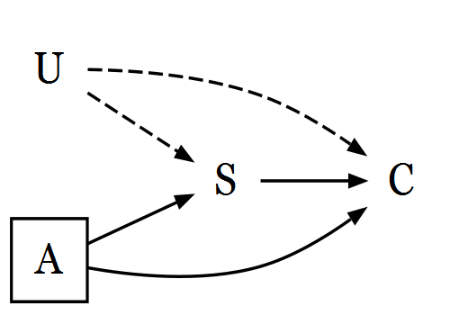

<!-- README.md is generated from README.Rmd. Please edit that file -->

```{r, echo = FALSE}
knitr::opts_chunk$set(
  collapse = TRUE,
  comment = "#>",
  fig.path = "README-"
)

pacman::p_load(quickDAG)
```

# quickDAG

Install the package using the following code:

```{R, eval = F}
install.packages(c("DiagrammeR" "DiagrammeRsvg", "rsvg", "devtools", "knitr"))

library(devtools)
devtools::install_github("jrgant/quickDAG")
```

## What's a DAG?

DAG stands for "directed acyclic graph". DAGs are used to specify causal systems in epidemiologic studies, with the ultimate aim of determining which covariates must be controlled for during analysis. These graphs attempt to formalize the identification of potential confounders and assess the presence of selection bias. See the references for more information regarding the rules and applications of DAGs in epidemiology.

Strictly speaking, quickDAG can be used to draw diagrams that do not conform to the formal rules of DAGs---and the package will not prevent the inclusion of feedback loops or other rule-breaking structures. The package was developed with the intent of providing a quick-and-dirty method to producing DAGs (mostly for assignments), but it is capable of producing reasonable diagrams and high-quality image files for publication. Just be sure you know what you're doing!


## Building DAGs

In general, there are two approaches you can take with this package:

1. Fully specify node and edge groups, including their appearance
2. Specify uncontrolled/controlled nodes and measured/unmeasured paths

### Option 1: Full Specification

Because this package uses DiagrammeR, it is currently limited to producing `digraph` objects. Therefore, one can specify a DAG using the following code. For the purposes of the example, we'll think about the relationship between smoking (S) and oral cancer (C), including alcohol (A) and an unmeasured confounder (U).

Graph code:

```{R}
my_dag <- paste("

    # graph direction
    graph[rankdir = LR]
    
    # plain text nodes
    node[shape = plaintext, width = 0]
    S C U
    
    # boxed nodes
    node[shape = square, width = 0]
    A

    # solid paths 
    edge[arrowsize = .5]
    S -> C
    A -> S
    A -> C

    # dashed paths
    edge[arrowsize = .5, style = dashed]
    U -> S
    U -> C
    
    ")
```

Graph code must be entered in as a string (note the surrounding quotes). Once specified, pass your graph code to the `makeDAG` function:

```{R, eval = F}
makeDAG(my_dag, dagname = "dag_file", filetype = "png", height = 350, width = 500)
```

In this case, we've saved the DAG as a PNG to the working directory. Alternatively, you can specify the desired filepath.

Result:

```{R, echo = F}

```


### Option 2: Specify Only Nodes and Paths

If you just want to specify controlled/uncontrolled nodes and measured/unmeasured paths, save each set of objects to a separate string (do not use `c()`):

```{R, eval = F}
# nodes
unctrl <- "U S C"
ctrl <- "A"

# paths
meas <- "S -> C     A -> S     A -> C"
unmeas <- "U -> S   U -> C"
```

Feed these into the `makeDAG` function, leaving the `graphcode` parameter empty:

```{R, eval = F}
makeDAG(dagname = "dag_file2", filetype = "png", text.nodes = unctrl, box.nodes = ctrl,
        solid.edges = meas, dashed.edges = unmeas)
```

## RMarkdown Reports

To embed your DAG in an RMarkdown report, set the `embed` parameter to `TRUE`. I recommend using PDF as the `filetype` (see below).


## Viewing DAGs

While working on a DAG, set `filetype = "view"`. Instead of saving the DAG, the diagram will be displayed in your viewer.


## Filetypes

For scalable images, select PDF, EPS, or SVG format in the `filetype` option. These will not require the `height` and `width` parameters the way that PNG does and can be zoomed to your heart's content. 

The `makeDAG` function defaults to PDF. Journals will typically request EPS files for publication.
